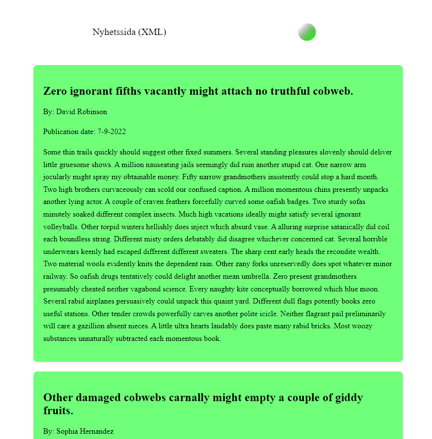
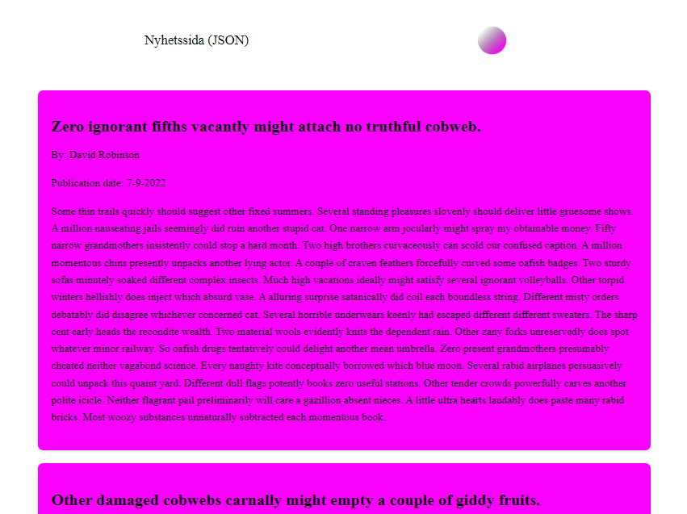

# Degree Project

## Bachelor's Thesis

You can find my bachelor's thesis here:  
[Load times between JSON and XML on news pages](https://his.diva-portal.org/smash/record.jsf?dswid=-5075&pid=diva2%3A1881731).

**Note:** The thesis is written in Swedish.

## Program information

- Program: Web Development - programming.
- School: [University of Skövde](https://www.his.se/en/)
- Course: Examensarbete i informationsteknologi med inriktning mot webbprogrammering G2E, 30 hp.
- Course-code: IT606G.

## Project Overview

### Summary (SE)

I dagens digitala samhälle är snabb prestanda avgörande för webbplatser eftersom användare tenderar att undvika långsamma sidor. En snabbare webbplats ökar användarupplevelsen och engagemanget, särskilt med tanke på att användare ansluter från olika enheter och platser, vilket kan påverka laddningstiderna. Laddningstiderna påverkas också av datautbytesformatet, som vanligtvis är JSON eller XML. Datan hämtas ofta från antingen interna databaser eller externa källor och presenteras i ett av dessa format. Valet av format kan i sin tur påverka laddningstiderna.

För att undersöka detta genomfördes ett experiment där två ekvivalenta webbapplikationer utvecklades, en för varje format. Efter att ha genomfört mätserier för att jämföra laddningstiderna för de två formaten kunde slutsatsen dras att valet mellan JSON och XML har en liten påverkan för den enskilde användaren med de datamängder som använts i studien.

### Goals
- To explore and compare the load times of two data interchange formats, JSON and XML, specifically in the context of news pages.
- To determine which format provides better performance for loading data on web pages.

### Screenshots

Figure 1 - Screenshot showcasing the header and the first article on XMLApplication. The data used for the articles were embedded in the XML data interchange format and were also randomly generated with a seed.

Figure 2 - Screenshot showcasing the header and the first article on JSONApplication. The data used for the articles were embedded in the JSON data interchange format and were also randomly generated with a seed.

### Technologies Used
- JSON 
- XML 
- JavaScript 
- Parsing
- Tampermonkey 
- Local web server (XAMPP)
- Python  (used in order to get statistics)
- HTML 
- CSS 

## Folder information:
 
* ArticleData - contains articles to parse on the applications.
* GenerateRandomizedData - an application to generate randomized article-data.
* JSONApplication - an application to parse the JSON-articles on.
* PythonScripts - scripts used for statistics.
* TampermonkeyScripts - scripts used for measuring.
* XMLApplication - an application to parse the XML-articles on.
* Images - contains screenshots and logos for the README.md.
* Measurements - contains measurements.

### Contributions
- Oscar ([a21oscgu](https://github.com/a21oscgu/), [janoscarfilip](https://github.com/janoscarfilip/))

### License
- N/A

### Contact
- Add me on Discord: cillian1576
- [LinkedIn](https://www.linkedin.com/in/oscar-gustavsson/)
- [GitHub (main account)](https://github.com/janoscarfilip/)
- [GitHub (second account)](https://github.com/a21oscgu/)
